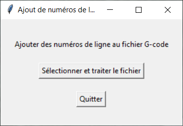

# Gcode Line Number

Un simple utilitaire pour ajouter des numéros de lignes à un fichier g-code.

Cet outil a été créer car nous avons une CNC qui exige des numéros de lignes dans le g-code et que certains logiciels que nous utilisons ne peuvent pas en ajouter.

## Télécharger

Pour télécharger une version pré-compilé :

__à faire__
